# BrandEx E-Commerce Platform

> [!IMPORTANT]
> **AI Disclosure:** This project utilizes AI-assisted coding tools. A full disclosure of its use, as required by university policy, can be found in [AI Disclosure.pdf](AI Disclosure.pdf).

A full-featured desktop E-Commerce application built with **JavaFX** and **PostgreSQL**, engineered with custom data structures and design patterns.

---

## Table of Contents

1. [Project Overview](#-project-overview)
2. [Technical Architecture](#-technical-architecture)
3. [System Requirements](#-system-requirements)
4. [Setup & Installation](#-setup--installation)
   - [Database Setup](#database-setup)
   - [Configuration](#configuration)
   - [Running the Application](#running-the-application)
   - [Building the Installer](#building-the-installer)
5. [Customer Features](#-customer-features)
   - [Account Management](#account-management)
   - [Shopping](#shopping)
   - [Cart Management](#cart-management)
   - [Checkout & Orders](#checkout--orders)
6. [Admin Features](#-admin-features)
   - [Product Management](#product-management)
   - [User Management](#user-management)
   - [Order Processing](#order-processing)
7. [UML Diagrams](#-uml-diagrams)
   - [Use Case Diagram](#use-case-diagram)
   - [Class Diagram](#class-diagram)
   - [Sequence Diagram](#sequence-diagram)
8. [FAQs & Troubleshooting](#-faqs--troubleshooting)
9. [Known Issues & Limitations](#-known-issues--limitations)

---

## Project Overview

BrandEx is a desktop-based E-Commerce platform for browsing, purchasing, and managing products. It provides two distinct experiences:

- **Customer Portal** — Browse products, manage a cart, place orders, and view your profile.
- **Admin Dashboard** — Manage products, users, and order fulfillment from a central control panel.

---

## Technical Architecture

### Stack

| Layer | Technology |
|---|---|
| Language | Java 25 |
| UI Framework | JavaFX 25 |
| UI Theme | AtlantaFX (Cupertino Dark) |
| Database | PostgreSQL |
| Build Tool | Apache Maven |
| Email | Jakarta Mail |
| Packaging | `jpackage` (Windows EXE/MSI) |

### Package Structure

```
com.brandex/
├── App.java                # JavaFX Application entry point
├── Main.java               # Launcher entry point (jpackage safe)
├── command/                # Command Pattern (Undo/Redo cart actions)
│   ├── Command.java
│   ├── CartAddCommand.java
│   └── CartRemoveCommand.java
├── database/
│   ├── JDBC.java           # Centralized prepared statement executor
│   └── DatabaseException.java
├── datastructures/         # Custom implementations
│   ├── BST.java            # Binary Search Tree
│   ├── LinkedList.java     # Linked List
│   ├── Queue.java          # Queue (Order processing)
│   ├── Stack.java          # Stack (Undo/Redo)
│   └── Node.java
├── models/                 # ADT Models
│   ├── Model.java          # Generic parent model
│   ├── Product.java
│   ├── User.java
│   ├── Cart.java, CartItem.java
│   ├── Order.java, OrderItem.java
│   └── enums/
│       ├── OrderStatus.java
│       ├── PaymentMethod.java
│       └── UserStatus.java
├── repository/             # Database Access Objects (CRUD)
│   ├── ProductRepository.java
│   ├── UserRepository.java
│   ├── CartRepository.java
│   └── OrderRepository.java
├── service/                # Business logic layer
│   ├── AuthService.java
│   ├── ProductService.java
│   ├── CartService.java
│   ├── OrderService.java
│   └── UserService.java
├── ui/                     # JavaFX Controllers
│   ├── AuthController.java
│   ├── DashboardController.java
│   ├── ProductCatalogController.java
│   ├── CartController.java
│   ├── ProfileController.java
│   ├── ProfileFormController.java
│   ├── ProfilePasswordFormController.java
│   ├── CheckoutController.java
│   ├── OrderHistoryController.java
│   ├── ManageProductsController.java
│   ├── ManageOrdersController.java
│   ├── ManageUsersController.java
│   ├── ProductFormController.java
│   └── EditUserDialogController.java
└── utilities/
    ├── ConfigLoader.java
    ├── EmailSender.java
    ├── ImageLoader.java
    ├── InputValidator.java
    ├── OTPGenerator.java
    ├── PasswordHasher.java
    └── StatusLabelHelper.java
```

### Design Patterns in Use

| Pattern | Where Used |
|---|---|
| **Singleton** | All Services and Repositories |
| **Repository** | `ProductRepository`, `UserRepository`, `CartRepository`, `OrderRepository` |
| **Service Layer** | `AuthService`, `ProductService`, `CartService`, `OrderService`, `UserService` |
| **Command Pattern** | Cart add/remove with full undo/redo support |
| **BST (Binary Search Tree)** | In-memory product and user stores; efficient sorted traversal |
| **Linked List** | Cart item storage |
| **Stack** | Undo/Redo command history |

---

## System Requirements

### End User (Running the Installer)
- **OS**: Windows 10 or later (64-bit)
- **Memory**: 4 GB RAM minimum (8 GB recommended)
- **Storage**: 300 MB free disk space
- **Network**: Internet connection for product images and email notifications.

### Developer (Building from Source)
- **JDK**: Java 25+
- **Build Tool**: Apache Maven 3.8+
- **Database**: PostgreSQL 14+
- **IDE**: IntelliJ IDEA, VS Code, or Eclipse (with Java extensions)

---

## Setup & Installation

### Database Setup

1. **Install PostgreSQL** and create a new database:
   ```sql
   CREATE DATABASE brandex;
   ```

2. **Run the schema script** to create all required tables:
   ```sql
   -- Users table
   CREATE TABLE users (
     id UUID PRIMARY KEY DEFAULT gen_random_uuid(),
     username TEXT UNIQUE NOT NULL,
     email TEXT UNIQUE NOT NULL,
     first_name TEXT,
     last_name TEXT,
     phone_number TEXT,
     shipping_address TEXT,
     role TEXT DEFAULT 'customer',
     status TEXT DEFAULT 'ACTIVE',
     password_hash TEXT NOT NULL,
     prev_hash_1 TEXT,
     prev_hash_2 TEXT,
     otp_hash TEXT,
     otp_used BOOLEAN DEFAULT FALSE,
     force_pw_change BOOLEAN DEFAULT FALSE,
     profile_image_url TEXT,
     created_at TIMESTAMPTZ DEFAULT NOW()
   );

   -- Products table
   CREATE TABLE products (
     id UUID PRIMARY KEY DEFAULT gen_random_uuid(),
     name TEXT NOT NULL,
     description TEXT,
     category TEXT,
     brand TEXT,
     image_url TEXT,
     price NUMERIC(10, 2) DEFAULT 0.00,
     rating NUMERIC(3, 1) DEFAULT 0.0,
     stock INT DEFAULT 0,
     created_at TIMESTAMPTZ DEFAULT NOW()
   );

   -- Carts table
   CREATE TABLE carts (
     id UUID PRIMARY KEY DEFAULT gen_random_uuid(),
     user_id UUID REFERENCES users(id) ON DELETE CASCADE,
     total_price NUMERIC(10, 2) DEFAULT 0.00,
     created_at TIMESTAMPTZ DEFAULT NOW(),
     updated_at TIMESTAMPTZ DEFAULT NOW()
   );

   -- Cart items table
   CREATE TABLE cart_item (
     id UUID PRIMARY KEY DEFAULT gen_random_uuid(),
     cart_id UUID REFERENCES carts(id) ON DELETE CASCADE,
     product_id UUID REFERENCES products(id) ON DELETE CASCADE,
     quantity INT DEFAULT 1,
     total_price NUMERIC(10, 2) DEFAULT 0.00,
     created_at TIMESTAMPTZ DEFAULT NOW()
   );

   -- Orders table
   CREATE TABLE orders (
     id UUID PRIMARY KEY DEFAULT gen_random_uuid(),
     user_id UUID REFERENCES users(id),
     order_number TEXT UNIQUE,
     status TEXT DEFAULT 'PENDING',
     shipping_address TEXT,
     payment_method TEXT,
     total_price NUMERIC(10, 2) DEFAULT 0.00,
     created_at TIMESTAMPTZ DEFAULT NOW()
   );

   -- Order items table
   CREATE TABLE order_item (
     id UUID PRIMARY KEY DEFAULT gen_random_uuid(),
     order_id UUID REFERENCES orders(id) ON DELETE CASCADE,
     product_id UUID REFERENCES products(id),
     quantity INT DEFAULT 1,
     total_price NUMERIC(10, 2) DEFAULT 0.00,
     created_at TIMESTAMPTZ DEFAULT NOW()
   );
   ```
---

### Configuration

The application reads from a `config.properties` file located at:
```
src/main/resources/com/brandex/config.properties
```

Create this file with the following keys:

```properties
# Database Connection
db.URL=jdbc:postgresql://localhost:5432/brandex
db.USER=YOUR_DB_USERNAME
db.PASSWORD=YOUR_DB_PASSWORD

# Product Images Base URL (where your product images are hosted)
db.PRODUCT_IMAGE_PATH=https://your-image-host.com/products/

# Email (SMTP via Gmail — requires an App Password)
email.user=your-email@gmail.com
email.password=your-gmail-app-password
```

> **Note on Gmail App Passwords:** To use Gmail for sending OTP and notification emails, enable 2-Factor Authentication on your Google account, then create an "App Password" under your Google Account Security settings. Use that 16-character password in `mail.password`.

---

### Running the Application

**Option 1 — Via Maven (Development)**
```bash
mvn clean javafx:run
```

**Option 2 — Via the Windows Installer (End Users)**
1. Download the `BrandEx-1.0.exe` from the [Releases](https://github.com/malikbennett/BrandEx-E-Commerce/releases) page.
2. Run the installer.
   > [!NOTE]
   > **Security Note:** Because this is an educational project, the installer is not digitally signed. You may see a Windows SmartScreen warning stating "Windows protected your PC." To proceed, click **"More info"** and then **"Run anyway"**.
3. Follow the prompts to complete installation.
4. Launch **BrandEx** from the Desktop or Start Menu shortcut.

---

### Building the Installer

To build the Windows installer from source:

```bash
# Step 1: Package the app and copy all dependencies
mvn clean package dependency:copy-dependencies

# Step 2: Copy the main JAR into the dependency folder
cp target/brandex-1.0-SNAPSHOT.jar target/dependency/

# Step 3: Run jpackage to create the .exe installer
jpackage \
  --input target/dependency \
  --name BrandEx \
  --main-jar brandex-1.0-SNAPSHOT.jar \
  --main-class com.brandex.Main \
  --type exe \
  --app-version 1.0 \
  --vendor "BrandEx Group" \
  --icon src/main/resources/com/brandex/images/icons/logo.ico \
  --win-shortcut \
  --win-menu \
  --win-dir-chooser \
  --win-shortcut-prompt \
  --win-menu-group "BrandEx"
```

The resulting `BrandEx-1.0.exe` will appear in your project root.

---

## Customer Features

### Account Management

#### Registering an Account

1. Launch BrandEx — the Login/Register screen appears.
2. Click the **Register** tab.
3. Enter your **First Name**, **Last Name**, **Email**, and **Username**.
4. Click **Register**.
5. A **One-Time Password (OTP)** will be sent to your email address.
6. On the OTP screen, enter the code from your email.
7. You will be prompted to **set a permanent password** on first login.

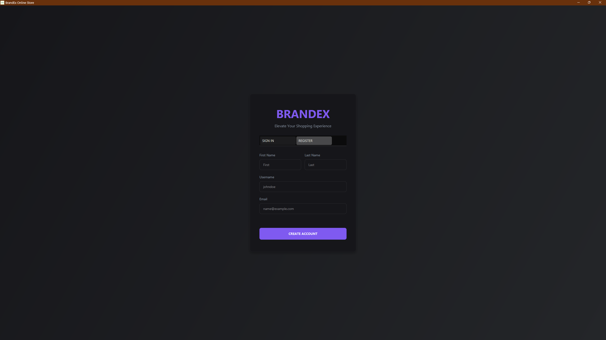

#### Logging In

1. On the Login tab, enter your registered **Email** and **Password**.
2. Click **Login**.
3. If your password has been reset by an admin, you will be required to change it before proceeding.

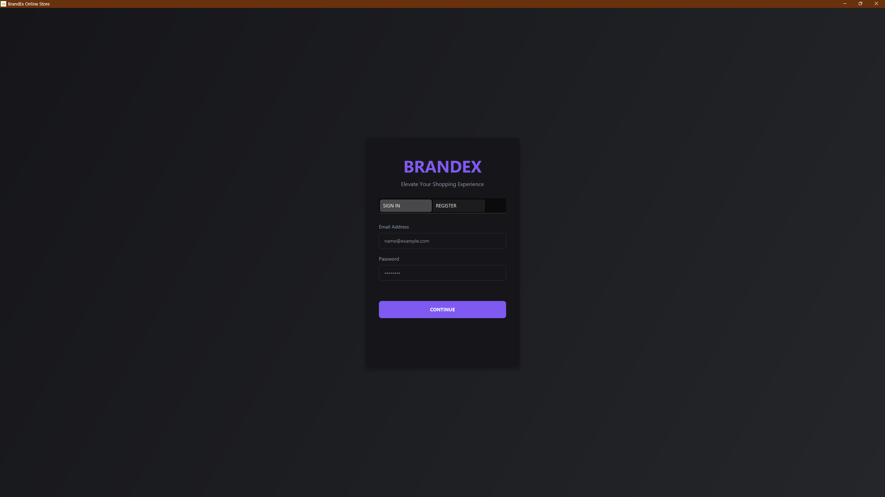

#### Viewing & Editing Your Profile

1. Once logged in, click the **Profile** button in the top navigation bar.
2. Your profile page displays:
   - Full Name, Username, and Email
   - Phone Number and Shipping Address
   - Account Role and Status (badge)
3. Click **Edit Profile** to update your information.
4. Click **Change Password** to update your credentials.
5. Click **Logout** to securely end your session.

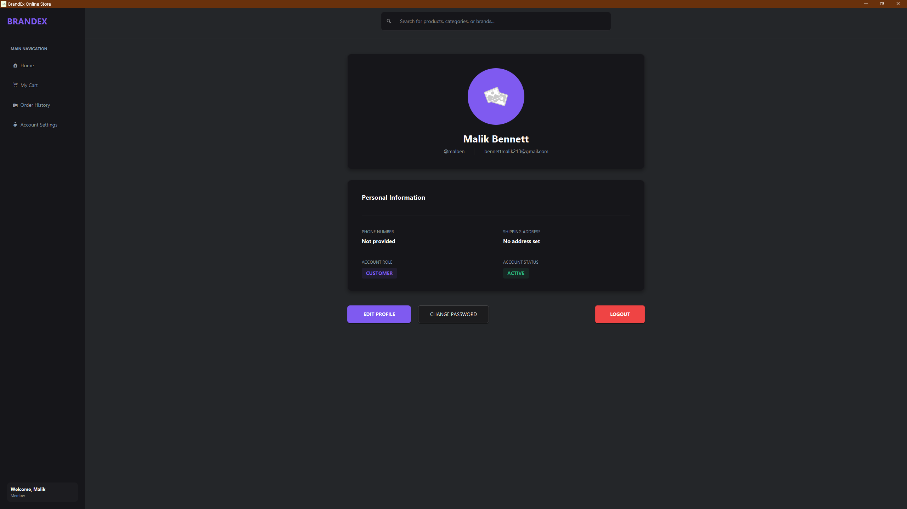

---

### Shopping

#### Browsing Products

1. After logging in, the **Product Catalog** is displayed by default.
2. Products are shown as cards with image, name, brand, price, rating, and stock.
3. Use the **Search Bar** at the top to filter products by name in real time.
4. Clear the search bar and press Enter to show all products again.

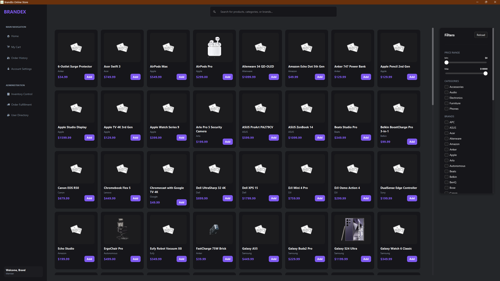

#### Viewing Product Details

- Each product card shows:
  - Product Name & Brand
  - Price and current Stock
  - Star Rating
  - Product Image
- On any product card, click the **Add to Cart** button.
- You can add the same item multiple times to increase quantity.
- The item is immediately added to your session cart.

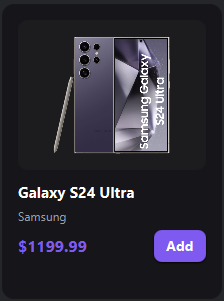

### Cart Management

1. Click the **Cart** icon/button in the navigation bar to open the cart panel.
2. The cart displays:
   - Each item with its name and total price
   - The running **Cart Total**
3. To **remove an item**, click the remove or delete button next to it.
4. Use **Undo** to restore a removed item.
5. Use **Redo** to re-apply a change.
6. Click **Checkout** to proceed to the payment screen.

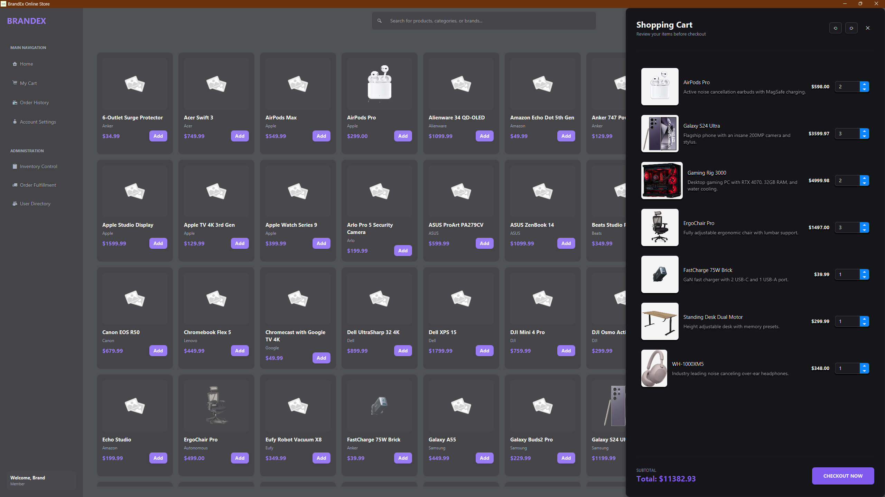

---

### Checkout & Orders

#### Placing an Order

1. From the Cart, click **Checkout**.
2. Review your cart summary and total.
3. Confirm your **Shipping Address**.
4. Select a **Payment Method**.
5. Click **Place Order** to finalize.

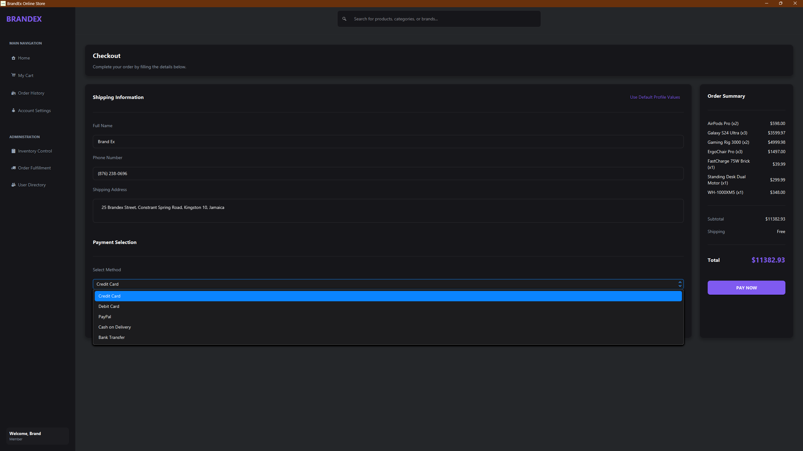

#### Viewing Order History

1. Click **Orders** in the navigation bar.
2. A list of your past orders is shown with:
   - Order Number
   - Date placed
   - Status (Pending, Shipped, Delivered)
   - Order Total

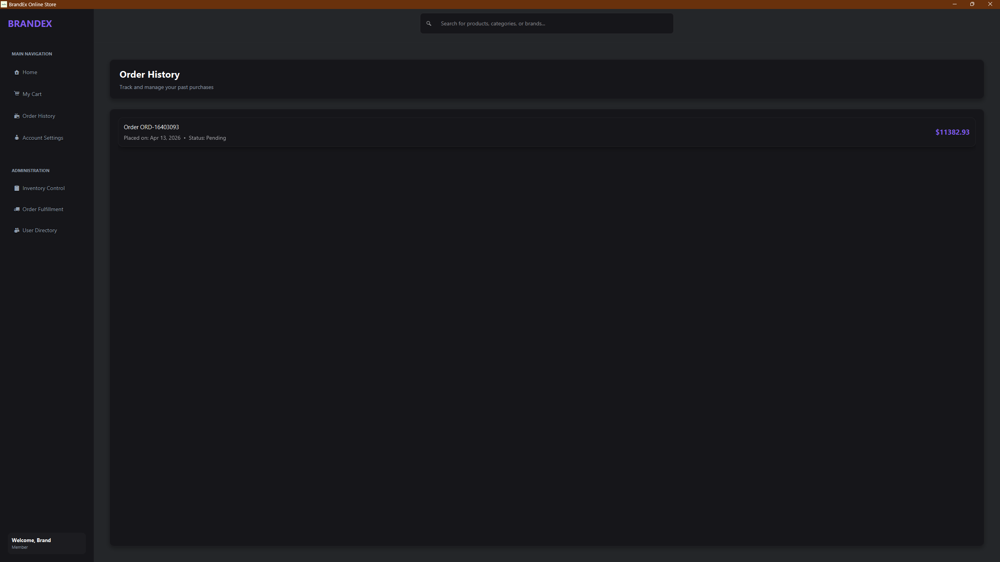

---

## Admin Features

Admin accounts have access to an extended navigation bar with management tools. Admin access is determined by the `role` field on the user account.

### Product Management

#### Viewing All Products

- A sortable table lists all products in the system.
- Columns: ID, Name, Brand, Description, Price, Stock, Category, Rating, Image URL, Date Created, Actions.

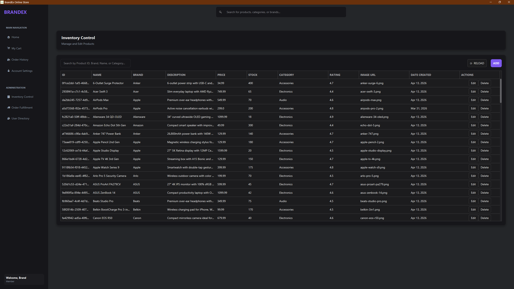

#### Adding a New Product

1. Click the **Add Product** button (top-right of the table).
2. A form dialog opens with empty fields.
3. Fill in: Name (required), Brand, Category, Price (required), Stock (required), Rating, Image URL, and Description.
4. Click **Save** to create the product. It is immediately added to the catalog.
5. Click **Cancel** to discard changes.

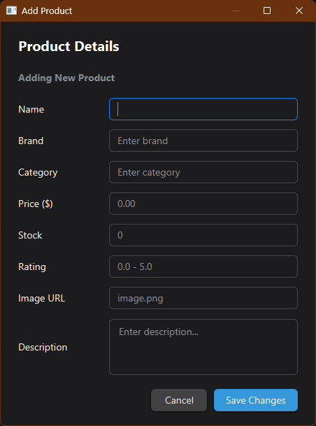

#### Editing a Product

1. In the product table, click the **Edit** button on the desired row.
2. The same form dialog opens, pre-populated with the product's current data.
3. Modify any fields.
4. Click **Save**. The product is updated in the database and the in-memory catalog simultaneously.

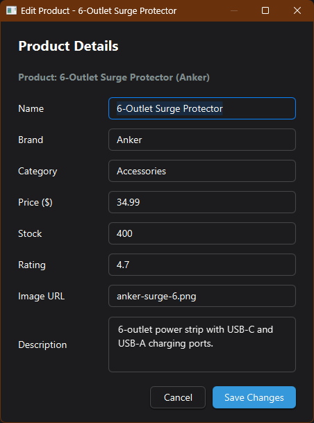

#### Deleting a Product

1. Click the **Delete** button on the desired product row.
2. A confirmation dialog appears: *"Are you sure you want to delete this product? This action cannot be undone."*
3. Click **OK** to permanently delete. The product is removed from both the database and the live catalog.

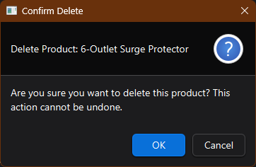

---

### User Management

Navigate to: **Admin Nav → Manage Users**

#### Viewing All Users

- A table lists all registered customer accounts.
- Columns: Full Name, Email, Username, Status, Role, Phone, Address, Joined Date, Actions.

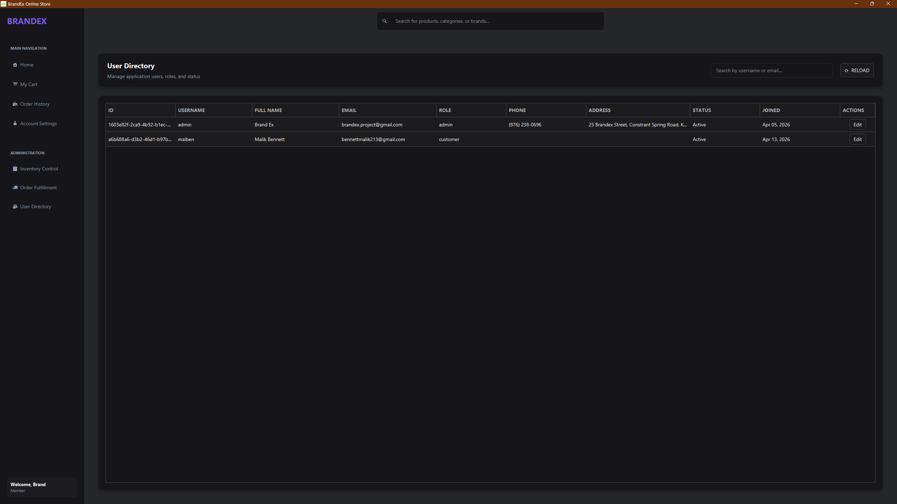

#### Editing a User's Status and Role

1. Click the **Edit** button on any user row.
2. An **Edit User Dialog** opens.
3. Modify the user's **Status** (Active, Suspended, Banned) and/or **Role** (customer, admin).
4. Click **Save** to apply changes.

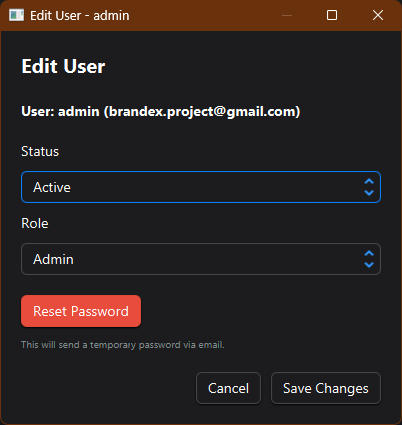

#### Resetting a User's Password

1. Click the **Reset Password** button in the Edit User Dialog.
2. A temporary password is automatically generated and emailed to the user.
3. The user's account is flagged with `force_pw_change = true`, requiring them to set a new password on next login.

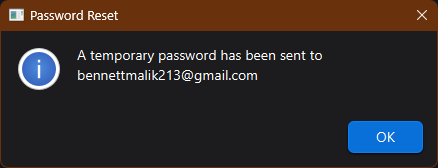

---

### Order Processing

Navigate to: **Admin Nav → Manage Orders** *(Feature in development)*

- View all pending orders in a queue.
- Process and update order statuses (Pending → Shipped → Delivered).
- Send customer notifications upon status changes.

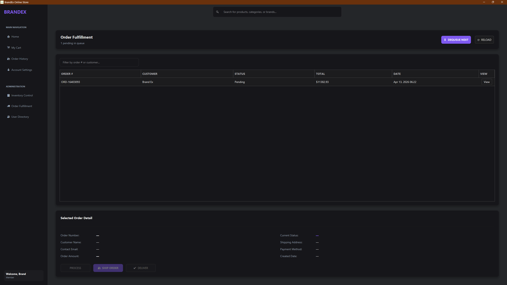

---

## UML Diagrams


### Use Case Diagram

The Use Case Diagram illustrates the interactions between system actors (Customer, Admin) and the available system features.

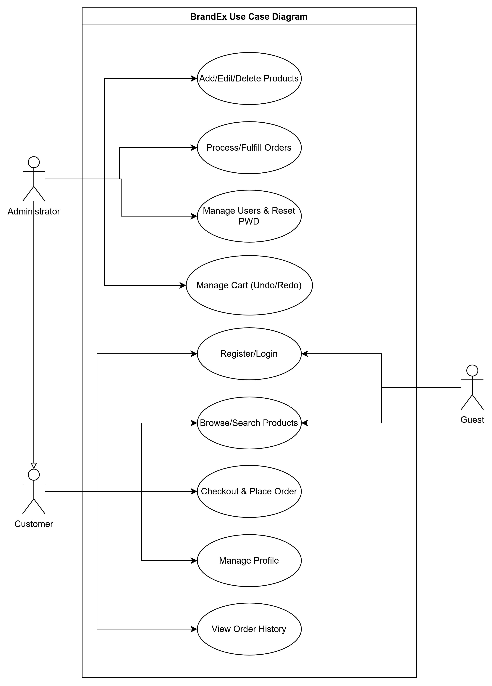

*   **Guest**: Can view the login/register screen.
*   **Customer**: Can browse products, manage cart, place orders, and view their profile.
*   **Administrator**: Has all Customer capabilities plus product CRUD, user management, and order processing.

---

### Class Diagram

The Class Diagram illustrates the domain model, technical layers, and the relationships between key classes.

**[View Full Detailed Class Diagram (PDF)](diagrams/Class%20Diagram.pdf)**

---

### Sequence & Activity Diagrams

Illustrates the flow of messages through the system and the core business logic for key workflows like Registration and Checkout.

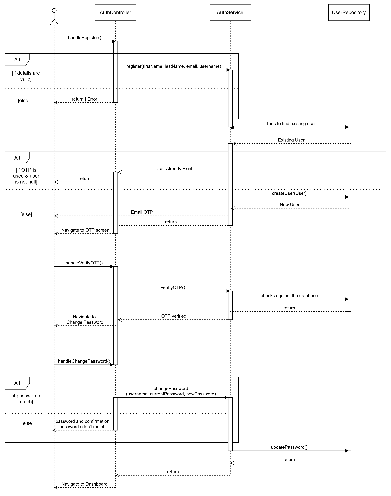

---

---

### Common Setup Issues

| Problem | Likely Cause | Solution |
|---|---|---|
| `Error loading FXML` on startup | Missing or corrupt resource files | Ensure you built from source with `mvn clean package` |
| `Connection refused` (DB error) | PostgreSQL not running | Start your PostgreSQL service and verify credentials in `config.properties` |
| Application opens but is blank | FXML controller binding issue | Check console for a `NullPointerException`, ensure all `fx:id` values are correct |
| OTP email not received | SMTP credentials invalid | Regenerate your Gmail App Password and update `config.properties` |
| Installer runs but app crashes | Missing JavaFX dependencies in package | Rebuild with `jpackage` using the full `target/dependency` folder as `--input` |
| `NoClassDefFoundError` for JavaFX | Main class extends `Application` directly | Ensure the entry point is `com.brandex.Main`, not `com.brandex.App` |

---

## Known Issues & Limitations

- The application currently targets **Windows only** for the packaged installer.

---

## 📬 Developers
- [Malik Bennett](https://github.com/malikbennett)
- [Ethan Dixon](https://github.com/powdem123)
- [Dylan Lee-Sue](https://github.com/dLyn-Sue)
- [Twyane Campbell](https://github.com/TwyaneCampbell)
---
